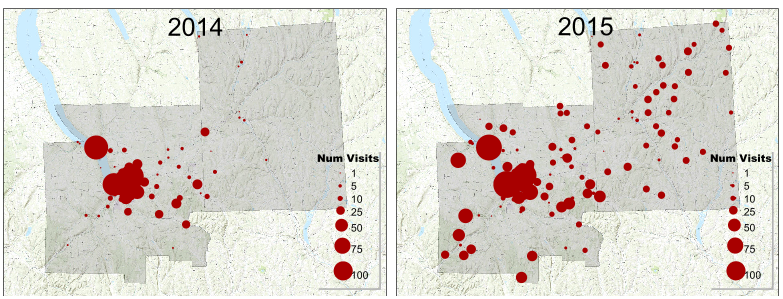

# Avicaching Scripts, Data, Files, Stats

#### Summer 2017 Project by [Anmol Kabra](https://anmolkabra.com), [Yexiang Xue](https://www.cs.cornell.edu/~yexiang), and [Prof. Carla Gomes](https://www.cs.cornell.edu/gomes) at [Cornell University, Ithaca, NY](https://www.cornell.edu)

Refer to the [**project report**](~link~).

## Overview of the Project
This research project focused on speeding up computation for the Avicaching game in eBird, enabling the organizers to get better results than before as well as scaling the game to a larger number of locations.

To do so, we model the Avicaching game with Neural Networks and Linear Programming, such that GPUs can accelerate tensor-based floating-point operations. The obtained GPU speedup can potentially help the organizers in 2 ways:

1. Allow organizers to run the models for more iterations and optimize the loss functions better.
2. Help organizers scale the Avicaching game to more locations such that they incentivize 'eBirders' when they visit under-sampled locations.

### What is Avicaching?
As described in the project report, the Avicaching game is an:
> ... incentive-driven game trying to homogenize the spatial distribution of citizens’ (agents’) observations. Since the dataset of agents’ observations in eBird is geographically heterogeneous (concentrated in some places like cities and sparse in others), Avicaching homogenizes the observation set by placing rewards at and attracting agents to under-sampled locations. For the agents, collecting rewards increases their ‘utility’ (excitement, fun etc.), while for the organizers, a more homogeneous observation dataset means better sampling and higher confidence in using it for other models.

For example, previous models for Avicaching, when deployed across 100+ sites in the Tompkins and Cortland counties in NY, were able to predict and influence agents' behavior. As shown in the figure below, the visit densities at previously under-sampled locations increased after Avicaching placed rewards at those locations.

## Dependencies:
| Dependencies | Version | Remarks|
| ------------- | --------- | -------- |
| Python | 2.x | Anaconda env recommended |
| PyTorch | >= 0.1.12 | Tested on 0.1.12 |
| NumPy | >= 1.12.1 | Tested on 1.12.1 |
| SciPy | >= 0.19.0 | Tested on 0.19.0 |
| CUDA | >= 8.0 | For GPU support, tested on 8.0 |
| `avicaching_data.py` | - | for data handling in all scripts |
| `lp.py` | - | LP implementation for the Pricing Problem's model |

## File Listing:
### Identification Problem files:
* `nnAvicaching_find_weights.py` - 3-layered neural network
* `nnAvicaching_find_weights_hiddenlayer.py` - 4-layered neural network
* For testing:
  - Optimization - `runNNAvicaching_weights_orig.sh`
  - GPU SPeedup - `runNNAvicaching_weights_rand.sh`

### Pricing Problem files:
* `nnAvicaching_find_rewards.py` - Using Algorithm 3 in the report
* For testing:
  - Optimization - `runNNAvicaching_rewards_orig.sh`
  - GPU Speedup - `runNNAvicaching_rewards_rand.sh`
  - Testing for baseline comparison - `test_rewards.sh`

### Miscellaneous files:
* `test_lp_time.py` - light version of `nnAvicaching_find_rewards.py` specifically for logging LP runtimes (Appendix B of report)
* `log_ram_usage_rewards.py` - logs CPU, RAM, GPU Usage while `./test_lp_time.py` is running
* `multiple_run.sh` - runs multiple test scripts on the machine
